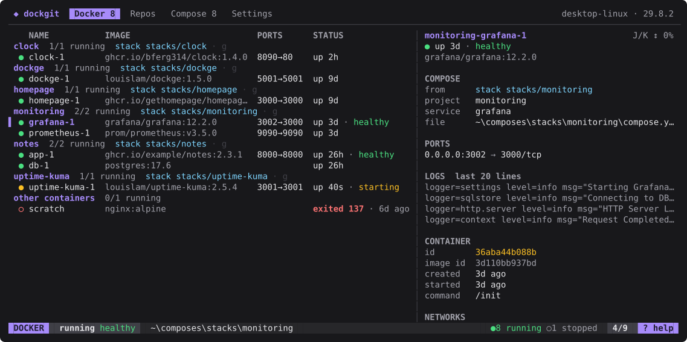
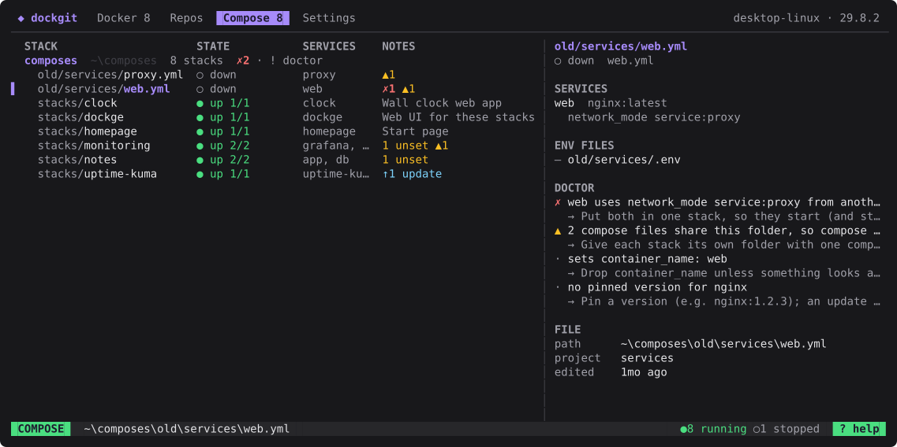

# dockgit

A terminal dashboard for your Docker containers, the git repos you build them from, and the compose stacks you run, all linked to each other.



```
dockgit
```

## Install

You need Go 1.26 or newer, `git`, and the `docker` CLI with Compose (Docker Desktop, or Docker Engine with the compose plugin).

```sh
go install github.com/bferg314/dockgit/cmd/dockgit@latest
```

Or download a binary for Linux, macOS or Windows from the [releases page](https://github.com/bferg314/dockgit/releases) and put it on your PATH.

This puts `dockgit` in `$(go env GOPATH)/bin` (`~/go/bin`, or `%USERPROFILE%\go\bin` on Windows). Make sure that folder is on your PATH. dockgit talks to Docker through the `docker` command, so whatever context, `DOCKER_HOST` and credentials work in your shell work here too.

## Tabs

Press `?` anywhere for the keys of the screen you're on, and `1`–`4` (or `tab`) to switch tabs. `/` filters any list, and `y` copies something from the selected row (a container's ID or URL, a repo's path, a stack's `up` command, the log lines on screen), over SSH too.

### Docker

Every container, grouped by compose project. Each project's heading says where it came from: `repo clock` (a repo on the Repos tab), `stack monitoring` (a stack on the Compose tab), or `gone services/web.yml` (a compose file that no longer exists). `g` jumps there.

- `enter` opens the actions; `l` follows logs full screen (`/` searches, `w` wraps, `t` shows timestamps), `s`/`S` start or stop and restart, `x` removes, `e` opens a shell in the container, `w` opens its first port in the browser, `o` opens its project folder in VS Code.
- `d` cycles the detail pane: beside the list, full screen, hidden. It shows the compose project, ports, mounts, the latest log lines, networks and environment (values masked until `m`).
- `a` shows or hides stopped containers, `t` adds CPU and memory columns.
- `i` lists images and `v` volumes, with what uses each; `x` removes unused ones. `C` shows disk use and prunes build cache, dangling images and stopped containers.

The list follows Docker's events, so containers started or stopped elsewhere show up within a second.

### Repos

Git repos you build with compose, added one folder at a time with `n`.

- `b` switches branch and rebuilds (`docker compose up -d --build`) in one go; the picker lists local and remote branches, and `ctrl+f` fetches.
- `u` pulls (fast-forward only) and rebuilds, `U` rebuilds, `D` takes the project down, `l` follows its logs.
- Uncommitted changes are never thrown away: `b` and `u` offer to stash them first.
- The BUILT column says when and from which branch dockgit last built the repo, and flags **stale** builds: running containers from another branch or an older commit.
- `w` opens the repo's web page, `o` opens it in VS Code, `c` picks its compose files.

### Compose

Folders (or git repos) of compose files, added with `A`. Each stack shows how many of its services are up, variables that are still unset, and "changed since up" when its file is newer than its running containers.



- `U` brings a stack up, `R` pulls newer images first, `D` takes it down, `l` follows its logs.
- `E` creates the stack's `.env` from its `.env.example` and opens it.
- `u` checks for image updates: pinned versions against the registry's newer tags, moving tags like `latest` by digest. `b` then bumps the versions in `compose.yaml`. On a root row, `u` checks every stack.
- `p` pulls a git root, `n` creates a new stack from a template.
- `!` runs the **doctor**: it checks the root against a simple layout (one folder and one `compose.yaml` per stack, every variable in an `.env.example`, no host port or `container_name` used twice, no `network_mode` reaching into another stack, pinned versions) and says how to fix each finding. Nothing requires the layout; loose files run as they are.

Env files are layered the way [dockge](https://github.com/louislam/dockge) does it: the root's `.env`, then `global.env` beside the stack folders, then the stack's own `.env`.

### Before anything starts

`U` and `R` on a stack, and `b`, `u` and `U` on a repo, first check what's in the way: host ports held by other containers, fixed container names already taken, the same service already running from somewhere else (an older deployment), and unset variables. If anything is, dockgit says what and offers to stop or remove those containers and continue.

### Settings

Tools to open things in, build cache cleanup, and display options, saved to the config file as you change them.

## Build cache cleanup

Builds leave cache behind. By default dockgit prunes it after every build it runs, keeping the newest 10 GB and anything used in the last week, and removes dangling images. Settings switches this to "when the cache passes 20 GB" (checked at startup, after builds and every hour) or off, and changes the sizes. `C` on the Docker tab prunes by hand.

## Config

On first run dockgit writes `config.toml` to your OS config folder (`%AppData%\dockgit` on Windows, `~/Library/Application Support/dockgit` on macOS, `~/.config/dockgit` on Linux) and turns on every tool it finds on your PATH.

```toml
compose_roots = ["~/code/composes"]
log_tail = 500                 # log lines the viewer starts with

[cleanup]
mode = "after_build"           # "off", "after_build" or "threshold"
keep_storage = "10GB"
older_than = "168h"
threshold = "20GB"
prune_dangling_images = true

[[repos]]
path = "~/code/clock"
compose_files = ["docker-compose.yml"]
project = ""                   # compose project name; empty means compose's default
env_file = ""

[[tools]]
name = "VS Code"
cmd = "code"
args = ["{path}"]
key = "o"                      # o opens things in this tool
mode = "detach"                # or "terminal": hands the terminal over until it exits
enabled = true

# For loose compose files: a project name, and env files to use instead
# of the layered ones (relative paths are from the file's folder).
[compose_overrides."~/code/stacks/services/web.yml"]
project = "web"
env_files = ["web.env"]
```

With no tool bound to `o` (on a server over SSH, say), files open in `$VISUAL` or `$EDITOR`, or else `vi` (Notepad on Windows).

Build records (which branch and commit each repo was built from) are kept in your OS cache folder.

### Zellij

Inside [zellij](https://zellij.dev/), terminal tools and container shells open in a new zellij tab instead of taking over dockgit's terminal. Turn it off with **Zellij tabs** in Settings.

## Development

```sh
go build ./cmd/dockgit
go test ./...
```

The UI tests drive the app with key presses and a fake Docker. Some tests run against the real Docker daemon; they create their own containers, images and projects, clean up after themselves, and never prune anything else:

```sh
DOCKGIT_IT=1 DOCKGIT_IT_IMAGE=busybox go test ./internal/ui -run TestLive
```

The screenshots above are drawn from a demo state by a test:

```sh
DOCKGIT_SCREENSHOTS=docs go test ./internal/ui -run TestScreenshots
```

[PLAN.md](PLAN.md) has the design, the milestones and the decisions behind them.

## Known limitations

- The update check only knows public images: it asks registries with anonymous tokens.
- "gone" compose files and "changed since up" are judged on the machine dockgit runs on. For a server, run dockgit there (or over SSH).
- Changing a setting rewrites `config.toml`, which removes comments you added by hand.

## License

[MIT](LICENSE)
